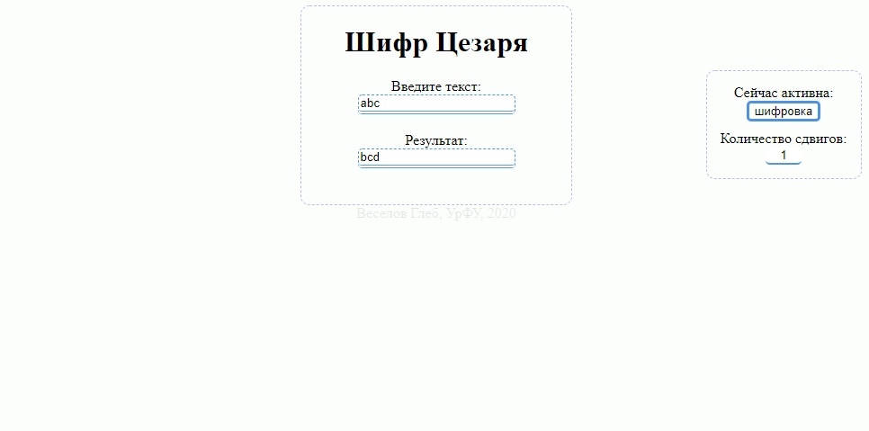

# Описание:
Программа построена по стандартному шаблону простых сайтов (html, css) и работает на чистом *JavaScript*. Введенный текст проходит фильтрацию (только английский алфавит), после чего выводится соответствующий результат, как показано на скриншоте:

# Открытие и использование:
* Необходимо открыть файл ___index.html___, чтобы запустить программу. Откроется бразуер, где в новой вкладке будет находиться интерфейс программы, показанный на скриншоте выше. 
*желательно открывать через браузер Google Chrome либо Yandex*

* Перед вами весь доступный функционал, под строчкой "Введите текст:" в форме ввода на центральной панельке введите желаемый текст, чтобы зашифровать его; ниже, под строчкой "Результат:", появится необходимый шифр. 
* На правой панельке находится управление шифрованием: под строчкой "Сейчас активна:" размещена кнопка переключения между шифровкой и расшифровкой кода, поставленный режим будет автоматически высвечиваться на этой же кнопке. Ниже, под строчкой "Количество сдвигов:", можно ввести в форму ввода необходимое количество сдвигов.

# Среда программирования: 
Программа построена на чистом JavaScript с использованием разметки html и стилей css. Открывать можно в любом удобном редакторе, который поддерживает данные форматы файлов, для примера, *Visual Code Studio*, *Notepad++* или *блокнот* 